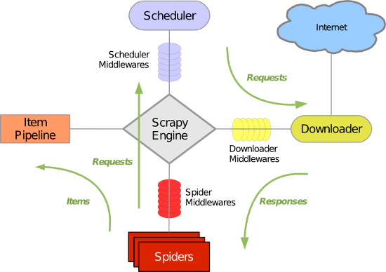
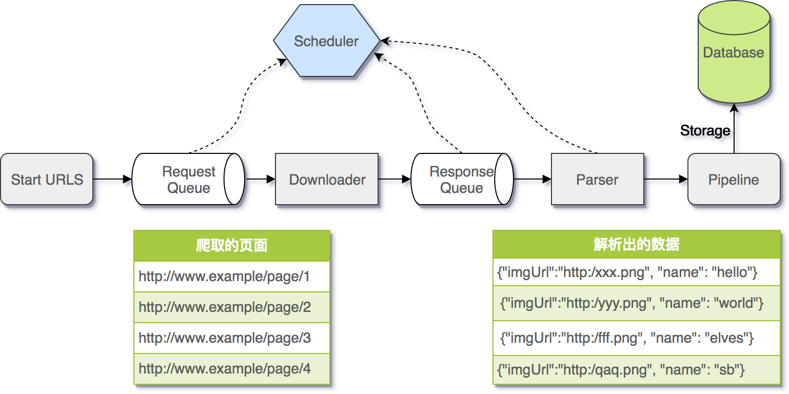

Java版本Scrapy

## 架构图

Scrapy主要包括了以下组件：

**引擎(Scrapy)
用来处理整个系统的数据流处理, 触发事务(框架核心)
**调度器(Scheduler)
用来接受引擎发过来的请求, 压入队列中, 并在引擎再次请求的时候返回. 可以想像成一个URL（抓取网页的网址或者说是链接）的优先队列, 由它来决定下一个要抓取的网址是什么, 同时去除重复的网址
**下载器(Downloader)
用于下载网页内容, 并将网页内容返回给蜘蛛(Scrapy下载器是建立在twisted这个高效的异步模型上的)
**爬虫(Spiders)
爬虫是主要干活的, 用于从特定的网页中提取自己需要的信息, 即所谓的实体(Item)。用户也可以从中提取出链接,让Scrapy继续抓取下一个页面
**项目管道(Pipeline)
负责处理爬虫从网页中抽取的实体，主要的功能是持久化实体、验证实体的有效性、清除不需要的信息。当页面被爬虫解析后，将被发送到项目管道，并经过几个特定的次序处理数据。
**下载器中间件(Downloader Middlewares)
位于Scrapy引擎和下载器之间的框架，主要是处理Scrapy引擎与下载器之间的请求及响应。
**爬虫中间件(Spider Middlewares)
介于Scrapy引擎和爬虫之间的框架，主要工作是处理蜘蛛的响应输入和请求输出。
**调度中间件(Scheduler Middewares)
介于Scrapy引擎和调度之间的中间件，从Scrapy引擎发送到调度的请求和响应。

## 调用流程图

Scrapy运行流程大概如下：

1. 引擎从调度器中取出一个链接(URL)用于接下来的抓取
2. 引擎把URL封装成一个请求(Request)传给下载器
3. 下载器把资源下载下来，并封装成应答包(Response)
4. 爬虫解析Response
5. 解析出实体（Item）,则交给实体管道进行进一步的处理
6. 解析出的是链接（URL）,则把URL交给调度器等待抓取

## 开源协议

[MIT](https://github.com/tianduo4/scrapy/blob/master/LICENSE)